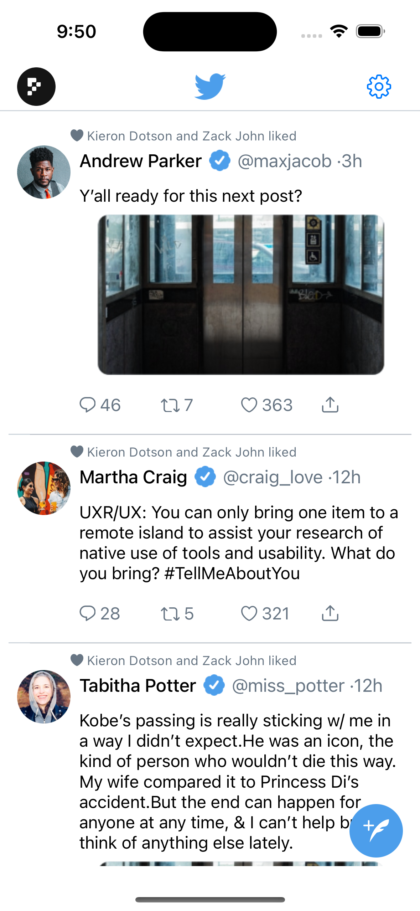

# twitter
Welcome to this repository

Here I have developed functionlity as required

1. On first step user will get Home Page  
2. user can scroll feed for latest tweets

Developement Summury :

1. Created UI in Main.Storyboard using UITableview,UILable,UIButtons and other UIKit Componengts.
2. Cretaed Tableview Cell XIB for Tweet Cell.
3. Created Controller Classes for both ViewController and Tableview Cell.
4. Created Model Struc for Tweet Data called "TweetDataModel"
5. Created view model for Tweet Home page and append some dummuy data usimg get data method.
6. Cretaed view model for cell data
7. Done dlegate and data source methods of thable view and set data in tweet tableview cell
8. Cretaed demo test case for available data is greted then 0 or no data

Refrence UI from https://www.figma.com/file/iMCavH2AWpth0f84oODt2j/Twitter-UI-Screens-(Community)?type=design&node-id=4-2990&mode=design&t=ZNd6cFcWYjZRLq5E-0

     

